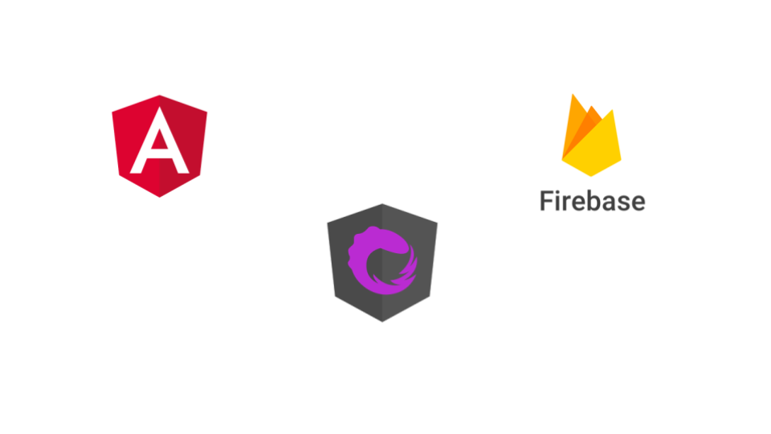

# Reactive Movie Store

The aim of this project is to build a modular and scalable application using Angular. 

This project was generated with [Angular CLI](https://github.com/angular/angular-cli) version 1.6.0.

Technology Stack : 

* Angular 4
* RxJS 5
* Angular Material 
* Firebase

The goal of the architecture and structure used in this application is to ensure :

* Scalability
* Modularity
* Separation of concerns ( less logic in the UI )
* Framework agnostic ( The same architecture would be easy to implement in React or Vue)
* Maintainability
* Be Reactive  => Everything should be a stream

This sample application includes the following features : 

* Modular application
* Routing
* Lazy loading
* Reactive forms & validations
* Testing
* Material design

# Application Modules 
The application is splitted into several modules. The image below represents the modules implemented in this application.

* **Core Module** : Core of the application, it contains the core layout, menu and logo.
* **Shared Module** : Contains shared features such as Material mdoules and several utility classes.
* **Catalog Movies Module** : Browse a collection of movies and view the details of each movie
* **Catalog Series Module** : Browse a collection of series and view the details of each serie
* **Cart Module** : Add movies or series to cart.
* **Auth Module** : Authentication ( Not implemented yet )

# Module Architecture

Each module in the application can be illustrated by 2 big parts : 
* **UI** : represented by components. This is the UI part that will be exported by each module.
* **Services** : side effects services like http services and local storage

## Development server

Run `ng serve` for a dev server. Navigate to `http://localhost:4200/`. The app will automatically reload if you change any of the source files.

## Code scaffolding

Run `ng generate component component-name` to generate a new component. You can also use `ng generate directive|pipe|service|class|guard|interface|enum|module`.

## Build

Run `ng build` to build the project. The build artifacts will be stored in the `dist/` directory. Use the `-prod` flag for a production build.

## Running unit tests

Run `ng test` to execute the unit tests via [Karma](https://karma-runner.github.io).

## Running end-to-end tests

Run `ng e2e` to execute the end-to-end tests via [Protractor](http://www.protractortest.org/).

## Further help

To get more help on the Angular CLI use `ng help` or go check out the [Angular CLI README](https://github.com/angular/angular-cli/blob/master/README.md).

